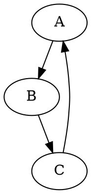

# くわしい話

実はRustを勉強しはじめた頃も一度エミュレーターを書こうとしたことがありました。Rustは速いコードが書けるし、バグを防ぐ機能が豊富で、型の表現力も比較的高いので、エミュレーターのような、速度が必要で、デバッグが大変なソフトを書くのには適した言語だと思ったわけです。しかし当時はRustへの理解度が低く、Rust特有のプログラミング上の制限を回避するすべがわからず頓挫していました。それから数年経って、さすがにもう大丈夫だろうと思ったので改めて書いてみたら、問題なく書けるようになっていました。

エミュレーターというのは実際の機械を模したプログラムなので、プログラムを実行するCPUやグラフィックを処理するPPU、サウンドを制御するAPUに、これらのコンポーネントがアクセスするメモリや情報のやり取りを行うバスなど、いくつかのコンポーネントから構成されています。そして、それらのコンポーネントが相互に通信を行ってプログラムが実行されていきます。

たとえば、CPUの「割り込み」というものがあります。割り込みというのは、CPUがプログラムを実行している最中に、別の処理をしてくれというリクエストを受け取ると、今実行しているものを中断して、そちらの処理を優先的に処理するといった機能です。なんでこんなものが必要なのかというと、たとえば、プログラム実行中にキーボードから入力があったとします。そうした場合に、プログラムの実行を一時中断して、キーボードの入出力を見に行かなければ、タイプされた情報を取りこぼすかもしれません。あるいは、マルチタスクのOSなら、一つのプログラムをずっと実行し続けていると、他のプログラムが実行できないどころかOS自体がハングしてしまいます。タイマーで定期的に割り込みを掛ければ、別のプログラムに制御を映すことができます。

そんなわけで、ほとんどのCPUに割り込みの機能が搭載されていて、ゲームボーイのCPUにももちろんこの機能があります。具体的には、割り込み要求が来てますよという信号と、その信号をセットしたりクリアしたりするためのIOレジスタがあります。このレジスタは垂直同期やタイマーが要求を出せるようにもなっているので、これらのコンポーネントからアクセスできなければなりません。またCPU自体も、割り込みを受理したことを伝えるために、これへの読み書きアクセスが必要になります。

さて、このレジスタをどこに置きましょうか。CPUの機能なのだからCPUに置きましょうか。CPUは問題なくこれにアクセスできます。そうするとPPUは、CPU内のこのレジスタにアクセスするために、CPUへの参照を持つ必要があると言うことになります。ところで、PPUもレジスタを持っています。たとえば、画面の表示をOn/Offするレジスタだったり、画面のスクロール位置を指定するレジスタだったりします。このレジスタはメモリ領域にマップされて、バス経由でCPUからアクセスできます。そりゃCPUが実行するプログラムがその辺のレジスタをコントロールするのですから、まあ当たり前と言えば当たり前です。

そうすると、CPUはバスへの参照を持ち、バスはPPUへの参照を持つ。そういうことになります。ところが最初の話から、PPUはCPUへの参照を持たなければなりません。うーん、困りました。Rustはこういった構造のデータをストレートに表現するすべを持ちません。なぜなら、こういった構造の参照関係に対する安全性を、Rustの型システムは表現できないからです。また、実はCPUも割り込みフラグに対するアクセスはメモリ空間にマップされたバス経由で行っているので、PPUを考えなくても、CPUが自分の割り込みフラグをクリアしようとするだけで、CPU→バス→CPUという循環したアクセスが発生してしまいます。

ならばバスをCPUに組み込んでしまえばいいのか？というと、やはりそれではダメで、結局PPUがCPUへの参照を持つ状態は解消できないので、最終的には一切のモジュール化を諦めるとかそういった極端な状況になってしまいます。

また循環参照が生じなくても、Rustには、あるオブジェクトへのmutableな参照を同時に1つしか持てないという制限があります。例えばCPUはバス経由でVRAMへの読み書きが可能で、PPUもレンダリングの際にVRAMを参照するのですが、この制約から、各オブジェクトがVRAMへの参照を持つという直接的な表現は不可能だということになります。

C++で書いていた時は、複数のコンポーネントから参照されうるリソースをまとめて一つのクラスに入れてしまって、各クラスがそのクラスへの参照を保持するという形にしていました。リソースクラスがCPUやPPUの参照を持って、CPUがそのリソースクラスへの参照を持つという格好です。オブジェクトの生存期間はプログラマーである自分が把握して管理しているということに何の疑問も持っていなかったし、当たり前のようにこういうコードを書いていたのですが、この例に関してはこれ自体が大きな問題になるわけでもないのですが、型でメモリエラーを防ごうとすると、こういう書き方が許されなくなるというのは、当時は想像もしていませんでした。

さて、これをどうすればいいのかというと、Rustのボローチェッカーを解決するには大きく分けて3つの方法が考えられます。一つは、ポインタとunsafeを使う方法です。ポインタは指しているオブジェクトのライフタイムを持たないので、これさえ使えば何でも解決できます。その変わりに、コンパイル時にも実行時にも安全性がチェックできなくなります。unsafeでもって、これで全てRustを使う意味がなくなるという主張をする人もいますが、保証されなくなる部分は限定的かつソースコードに明示される訳なので、これはナンセンスな話でしょう。

とはいえ、unsafeの箇所は少なければ少ないに越したことはありません。そういうわけで、RustではRustのライフタイムで表現しづらいものを記述するために、unsafeだけでなくランタイムにチェックを行うというオプションも提供されています。`RefCell`がそれにあたります。`RefCell`を使えば、mutableではない参照の値を書き換えられます。同時に複数のオブジェクトが書き換え可能な参照を持たないことをランタイムにチェックするから、これでもメモリ安全性が保たれるという理屈です。もちろんそういった使い方をしようとすれば、ランタイムにエラーが起きます。これと`Rc`を組み合わせると、ランタイムに所有権とボローをチェックする代わりに、オブジェクトの参照関係をほとんど柔軟に表現することができます。`Rc`はオブジェクトに対する複数の所有権を許すけど、非mutableな参照しか作れないので、`RefCell`と組み合わせた`Rc<RefCell<T>>`、複数のオブジェクトが書き換え可能な参照を共有することができると言うことになる訳です。なんでこんなしちめんどくさいことになっているのかというと、これらそれぞれがメモリへのオーバーヘッドとランタイムの計算時間のコストを増加させるので、使わない機能に関して、例えば所有権は共有したいけど、書き換えは出来なくてもいいといったようなユースケースで余計なコストを払わなくて済むようなオプションを与えるために、単機能ごとにラッパーオブジェクトを定義するのがRustの設計思想なんだと思います。ちなみにさらにスレッド間でオブジェクトを共有したいような場合は排他処理が別途必要になるので、これも`Rc`の代わりに`Arc`、`RefCell`の代わりに`Mutex`で`Arc<Mutex<T>>`を使うといったパターンがあります。他の言語だと全部ひとまとめになってて、何もいらないときでもコストを払うだとか、そもそも安全じゃないとかいろいろありますが、Rustはその辺一貫したデザインにはなっていると思います。その分、初学者には何が何だかわからないという側面もある気はしますが。

これでVRAMのような複数のオブジェクトが書き換え参照を持ちたいようなものは、`Rc<RefCell<Vec<u8>>>`などにすれば、とりあえずは表現できると言うことになるのですが、循環参照はまだ問題として残っています。そもそも循環参照はGCのないRustで自然にメモリを管理することができないので、表現できないのが正しいんだろうということにはなりますが、現実には困ることもあります。一般論としては、Weak referenceを用いて、一部においてオブジェクトの生存自体をランタイムにチェックさせることで、つじつまを合わせることはできます。Rustでも`Rc`のweak referenceを作ることができます。

というわけで、`Rc<RefCell<T>>`と`Weak`を駆使すれば、ランタイムに安全性をチェックする形で、他の言語での設計をそのままにRustに持ってくることは可能です。しかし、その代償として、安全性のチェックをコンパイルタイムではなくランタイムに遅らせることでコンパイラが保証できる安全性が減るということ、その上メモリフットプリントと実行時間のオーバーヘッドが上乗せされること、アクセスのたびに毎回ランタイムにチェックを入れなければならないのでコードが煩雑になる、などのいろいろうれしくないことを受け入れなければなりません。

unsafeを使う、ランタイムにチェックを遅らせる、の他のもう一つの解決方法としては、設計を変えるというのがあります。これは前者2つとは違い、常に可能とは限らず、頭も使うし、できたとしても良いコードとは限らないので、一番大変です。実際、Rust勉強当初にエミュレーターを書こうとして頓挫したのは、これで何とかしようとして、いくらうんうんうなってもコンパイルが通る設計を思いつかなかったからでした。とはいえ、うまくいけばランタイムのコストなしで、コンパイル時に安全も保証される、一番素晴らしい方法です。

一般的には、ボローチェッカーが通らない構造をどうすれば通るようにできるのかという万能な方法があるわけではないのですが、いくつかパターンのようなものは考えられます。ここでは今回解決するのに用いた2つのパターンを紹介しようと思います。

一つ目は、オブジェクトの循環参照の解消のための、共有部分の括りだしです。

相互に参照を持つオブジェクトであっても、実際はその参照を用いてアクセスする必要のあるフィールドは一部だったりします。例えば、CPUとPPUの場合だと、CPUからPPUへの参照は、間接的にほぼ全てのPPUのレジスタを参照する可能性がありますが、PPUからCPUへの参照は、割り込み要求だけなので、必要なのはごく一部と言うことになります。そういうわけで、

